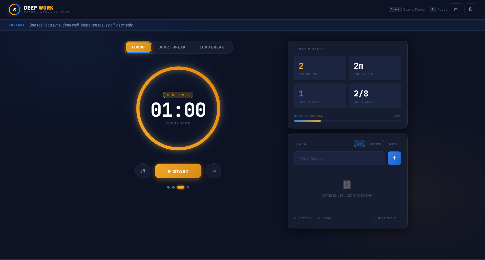
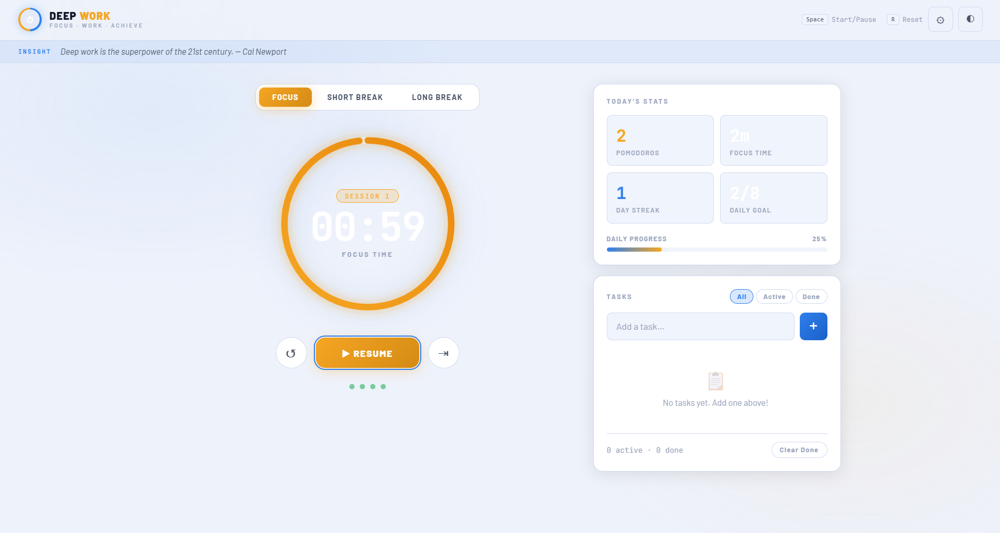
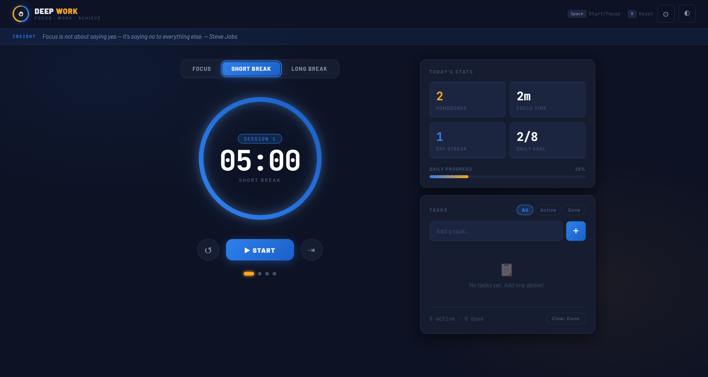
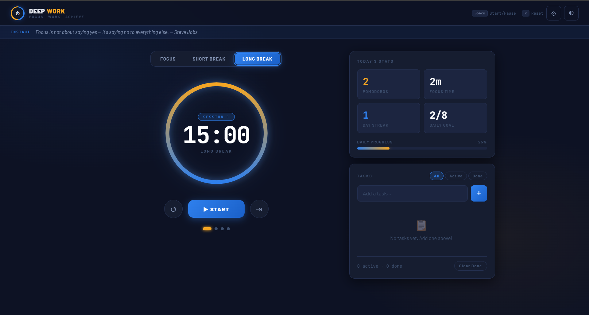
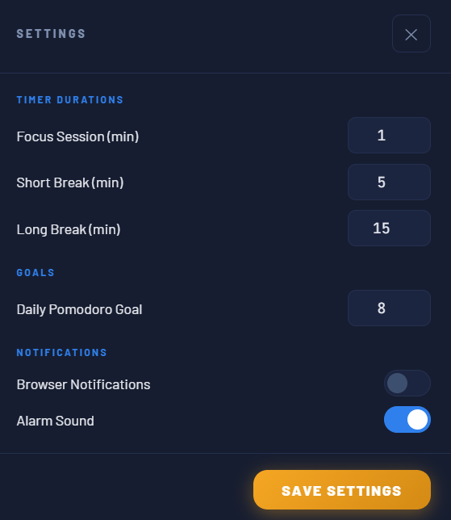

# Deep-work-timer-v1
A modern Pomodoro productivity app with task management, statistics, focus tracking, and customizable work sessions.
# Deep Work Timer

A modern Pomodoro productivity application built with HTML, CSS, and JavaScript.

## Features

- Focus Timer (Pomodoro Technique)
- Short & Long Break Sessions
- Task Management System
- Daily Productivity Statistics
- Streak Tracking
- Dark & Light Theme
- Browser Notifications
- Custom Timer Settings
- Local Storage Support

## Tech Stack

- HTML5
- CSS3
- JavaScript
- LocalStorage

## Live Demo

https://siddharth-singh-cs.github.io/Deep-work-timer-v1/

## Screenshots

### Main Timer

### Light Mode

### Short Break

### Long Break

### Settings

## Author

Siddharth Singh
